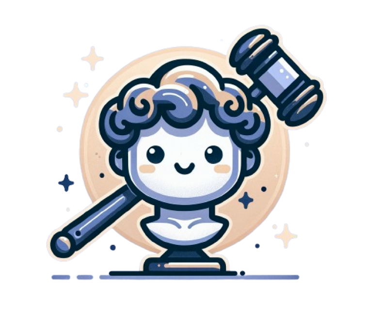

<h1>
 다비드: DABID</h1>
<hr>

### 프로젝트 개요 🎥
> 경매 기반의 중고 안심 거래 플랫폼

### 프로젝트 제안배경
> 기존의 선착순 위주의 중고거래, 간편한 국내 중고 거래 환경의 부재했습니다.<br/>때문에 중고 거래의 비용 측면을 살리고 시간적 여유를 확보하며, <br/> 국내 배송 비대면 거래 지원이 세가지를 제공하는 프로젝트를 기획하게 되었습니다.
### 개발 기간
> 2024-08-19 ~ 2024-10-11

### 🧑‍🤝‍🧑 Team members (채워주세요)
##### |  Backend  / Frontend |<br/>
|   유우준(팀장)   |   조성욱   |   황태건   |   이민정   |   장윤주   |   홍번선(FE 총괄)   |
| --------- | ---------| ---------| ---------| ---------| ---------|
|경매 FE, BE 담당<br/>ELK Stack 적용|경매 FE, BE 담당<br/>Prometheus 적용<br/>실시간 채팅 지원|거래 FE, BE 담당<br/>Stomp + Kafka 실시간 채팅 적용<br/>Escrow 서비스 적용|회원 관리 FE, BE 담당<br/>SSAFY 금융망 API 적용<br/>다비드 고객센터 관리|회원 관리 FE, BE 담당<br/>SSAFY 금융망 API 적용<br/>다비드 고객센터 관리|거래 FE, BE 담당<br/>Delivery Tracker 서비스 적용| 
<hr>

### 실행 환경 (채워주세요)
> | TECH                        | Version |
> | --------------------------- | ------- |
> | React                       | 18.3.1  |
> | ReactQuery                  | 5.59.0  |
> | Recoil                      | 0.7.7   |
> | TypeScript                  | 5.5.4   |
> | Tailwind                    | 0.4.4   |
> | Spring boot                 | 3.3.3   |
> | Spring Security             | 6.3.3   |
> | JWT                         | 0.11.2  |
> | Flask                       | 3.0.3   |
> | OpenAI                      | 1.5.0   |
> | Kafka                       | 2.8.1   |
> | MySQL                       | 8.0.33  |
> | MongoDB                     | 6.0.17  |
> | Redis                       | 7.4.0   |
> | ElasticSearch               | 8.6.2   |
> | Logstash                    | 8.6.2   |
> | Kibana                      | 8.6.2   |
> | Prometheus                  | 2.54.1  |
> | Nurigo(SMS 전송)            | 4.3.0   |
> | Apache POI (엑셀 문서 생성) | 5.3.0   |


</br>

## 💻 Tech Stack (채워주세요)
### 🔐 Backend
>


### 🌅 Frontend (채워주세요)
>     

## 사용 방법
### 🔐 Backend
> ```
> $ ./gradlew clean build;
> $ java -jar build/libs/*SNAPSHOT.jar
> ```
### 🌅 Front-end
> ```
> $ npm install
> $ npm start
> ```


## 🖥️ 목표 서비스 구현 및 실제 구현 정도 및 핵심 기능 설명

|회원가입|
| :---: |
||
|<회원가입&로그인> <br/> - 채워주세요 |
<hr>

|경매 페이지|
| :---: |
||
| <경매 페이지> <br/> - 채워주세요 |
<hr>

|거래 페이지|
| :---: |
||
| <거래 페이지> <br/> - 채워주세요 |
<hr>

|챗봇 페이지|
| :---: |
||
| <챗봇 페이지> <br/> - 채워주세요 |
<hr>

|고객센터 페이지|
| :---: |
||
| <고객센터 페이지> <br/> - 채워주세요 |
<hr>

## ERD


## Architecture


## 느낀점
> 1. 유우준
> - 팀장으로서 훌륭한 팀원들과 협력하여 성공적인 프로젝트 결과물을 만들어낼 수 있었습니다. 특히 엘라스틱 서치를 적용하여 성능 향상을 이루었으며, 그 과정에서 많은 것을 배울 수 있었습니다.
> 2. 장윤주
> - 좋은 팀원들과 함께 프로젝트를 진행하며 많은 것을 배웠습니다. 프론트엔드뿐만 아니라 백엔드 기술에 대해서도 새로운 경험을 쌓을 수 있었습니다.
> 3. 이민정
> - 채팅 기능을 직접 개발하고, 이를 몽고DB에 저장해 지속적으로 사용할 수 있는 기능을 구현하며 자신감을 얻었습니다.
> 4. 조성욱
> - 프로메테우스를 활용해 성능 최적화를 시도해보았고, 훌륭한 팀원들과 함께 일하며 많은 것을 배웠습니다.
> 5. 홍범선
> - 프론트엔드에서 새로운 기술들을 학습하고 적용해볼 수 있는 기회였습니다. 또한 좋은 팀원들과 함께 프로젝트를 진행하며 많은 것을 배웠습니다.
> 6. 황태건
> - 인프라에 대해 깊이 배우는 계기가 되었으며, 챗봇 기능을 개발하면서 프롬프트 엔지니어링에 대해 많은 것을 배웠습니다.
